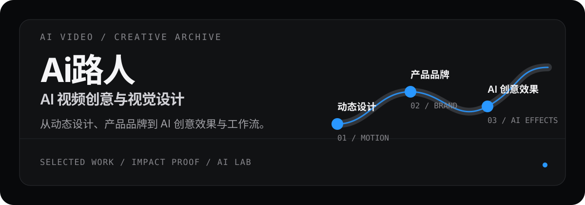

# Ai路人｜AI 视频创意与视觉设计作品集

<p align="center">
  
</p>

<p align="center">
  动态设计师的 AI 创作档案：把图像、视频、特效玩法和可复用的创意工作流，整理成一个可以直接浏览的单页作品集。
</p>

<p align="center">
  <a href="https://ai-luren.github.io/">在线浏览</a> ·
  <a href="https://ailuren.pages.dev/">国内访问</a> ·
  <a href="#本地运行">本地运行</a> ·
  <a href="./docs/交接说明.md">交接说明</a>
</p>

## 先看作品

这些是站点精选创作档案中的真实封面。点击在线作品集，可以继续查看完整作品、获奖证据、平台发布记录和 AI 实验。

<p align="center">
  
  
</p>
<p align="center"><sub>通义万相先导片 · 光 AI 概念短片</sub></p>

<p align="center">
  
  
</p>
<p align="center"><sub>猫咪的一天 · 人河流城市</sub></p>

## 这是一个什么项目

这是一个以滚动视频为叙事主线的个人作品集，不是传统的项目管理后台。页面把创作路径拆成几个可以直接浏览的模块：

- **精选创作档案**：AI 创意广告、概念短片和品牌视觉作品。
- **工作经历**：从动态设计、三维与品牌，到特效玩法、AI 效果和 AIGC 内容创作。
- **AI 影响力**：获奖作品、AI 视频平台合作创作者身份，以及抖音、小红书等内容发布证据。
- **AI 实验室**：持续探索中的 Vibe Coding、AI 工具和可复用工作流。

## 交互体验

- 桌面端使用轻量 hover、焦点和章节过渡，让卡片有反馈但不抢走作品本身的注意力。
- 手机端支持精选作品、工作经历和获奖作品左右滑动，同时保留原生纵向滚动。
- 移动导航保持固定位置，菜单展开时使用稳定的 `=` / `×` 过渡和逐项出现的导航内容。
- 中英文页面都使用系统字体栈，并针对手机与桌面视口做布局回归。

## 技术结构

页面入口和媒体叙事保持直接可读，React 只承载需要组件化的交互模块：

```text
index.html
  ├─ 页面章节、背景视频、全局样式、滚动逻辑
  └─ React 19
       ├─ 精选创作档案
       ├─ AI 影响力证据
       ├─ AI 实验室
       └─ GSAP / WebGL 视觉交互
```

这个混合架构是有意保留的：静态内容和媒体路径容易维护，React 负责作品档案、影响力模块、实验卡片和页脚 Dock 等交互组件；GSAP 与 ScrollTrigger 通过 `vendor/` 和运行时降级逻辑加载。

## 在线地址

- [GitHub Pages](https://ai-luren.github.io/)：主站入口，中国大陆网络可能无法直连。
- [Cloudflare Pages](https://ailuren.pages.dev/)：国内访问优先地址。
- [Netlify](https://ailuren.netlify.app/)：备用生产地址。
- [Vercel](https://ailuren.vercel.app/)：备用生产地址，中国大陆网络可能无法直连。

四个平台使用同一套构建配置，生产分支为 `main`，构建命令为 `npm run build`，发布目录为 `dist/`。

## 本地运行

需要 Node.js 20 或 22。

```bash
git clone https://github.com/Ai-luren/Ai-luren.github.io.git
cd Ai-luren.github.io
npm ci
npm run dev
```

然后打开 <http://127.0.0.1:5174/>。不要双击 `index.html` 或使用 `file://` 打开，因为视频、相对路径和 React 模块需要由 Vite 提供服务。

### 构建与检查

```bash
npm run build
npm run check:i18n
git diff --check
```

`check:i18n` 会扫描中英文在手机与桌面视口下的溢出、截断、导航适配和关键模块布局。

## 目录速览

```text
.
├── assets/                 页面媒体、图标和 README 展示素材
├── docs/                   设计规范与交接说明
├── src/components/         作品档案、影响力和实验室组件
├── src/i18n/               中英文文案与语言切换
├── vendor/                 GSAP 与 ScrollTrigger 静态运行时
├── index.html              单页入口、章节、全局样式和媒体叙事
├── package.json            依赖与脚本
└── vite.config.js          Vite 构建配置
```

常见修改入口：

- 页面章节、首屏和页脚：`index.html`
- 精选创作档案：`src/components/MagneticProjectArchive.jsx`
- 获奖、平台和社交证据：`src/components/ImpactEvidence.jsx`
- AI 实验室卡片：`src/components/ExperimentFlip.jsx`
- 中英文文案：`src/i18n/dictionary.js`
- 字体、颜色、间距和动效：`src/styles/apple-system.css`

开始维护前，请先阅读 [`AGENTS.md`](./AGENTS.md)、[`docs/设计规范.md`](./docs/设计规范.md) 和 [`docs/交接说明.md`](./docs/交接说明.md)。

## 部署约定

```text
修改 → npm run build → npm run check:i18n → git diff --check
     → Pull Request → 检查预览 → 合并 main → 自动部署
```

`main` 受保护，不建议直接推送。GitHub Pages 使用仓库内的 Actions 工作流构建并发布 `dist/`；Cloudflare Pages、Vercel 和 Netlify 使用各自的平台 Git 集成。

## 许可证与联系

本项目以 [MIT License](./LICENSE) 发布。

完整作品、联系方式和社交入口会随页面内容更新，优先从[在线作品集](https://ai-luren.github.io/)查看最新版本。

Copyright (c) 2026 Ai路人
